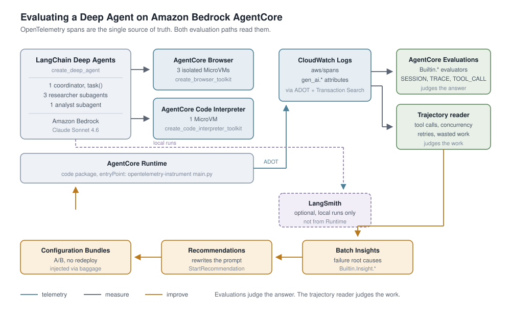

# Evaluating Deep Agents on Amazon Bedrock AgentCore

Go from an eval suite that looks green and measures nothing, to one that catches a real
regression in a deployed agent and verifies the fix. Three notebooks, each one story
beat, each runnable on its own.



The agent under evaluation is a due-diligence Deep Agent over SEC filings: a coordinator
fans out one browser researcher per company through `task()`, each in its own AgentCore
Browser MicroVM reading that company's 10-K financial statements, then hands the figures
to an analyst on an AgentCore Code Interpreter which computes SaaS metrics and a chart.

The three companies are Snowflake, Datadog and MongoDB. Each researcher reads about
60,000 characters of statement text and returns roughly 300 characters of figures, so the
delegation is doing real work: the same material in one context would be about 110,000
tokens of raw filings.

## Tutorial details

| | |
|---|---|
| **Frameworks** | LangChain Deep Agents (`create_deep_agent`), LangGraph |
| **AgentCore features** | Browser, Code Interpreter, Runtime, Evaluations, Insights, Recommendations, Configuration Bundles |
| **Agent pattern** | Coordinator with three parallel browser subagents and one interpreter subagent |
| **Ground truth** | 10-K statements pinned by SEC EDGAR accession number, with the answer key generated from the XBRL `companyfacts` API |
| **Complexity** | Beginner to advanced (progressive) |
| **Model** | Claude Sonnet 4.6 on Amazon Bedrock (`us.anthropic.claude-sonnet-4-6`) |

## The three story beats

| # | Notebook | The story | Runtime | Cost |
|---|---|---|---|---|
| 1 | [`01_evaluate_deep_agents_locally.ipynb`](./01_evaluate_deep_agents_locally.ipynb) | **Your eval passes and measures nothing.** Three pitfalls, each demonstrated, then checks that provably fail when behavior breaks. | ~3 min | Bedrock + MicroVMs |
| 2 | [`02_score_traces_with_agentcore_evaluations.ipynb`](./02_score_traces_with_agentcore_evaluations.ipynb) | **Score real traces with AWS evaluators, in seconds.** Replay recorded spans, no agent invocation, no deploy. | ~2 min | `Evaluate` calls only |
| 3 | [`03_close_the_loop_on_agentcore_runtime.ipynb`](./03_close_the_loop_on_agentcore_runtime.ipynb) | **Let AgentCore find the bug, then verify its fix.** Deploy, cluster failures, get a prompt rewrite, A/B it. | ~60 min | real, teardown included |

Notebook 2 needs no deploy and no agent run, so it is the cheapest way to learn the
evaluation API. Start there if you only have a few minutes.

## What you will learn

1. **A Deep Agent's final state hides its subagents.** `result["messages"]` contains only
   the coordinator's tool calls, so the obvious check passes whether or not a researcher
   misbehaved.
2. **Parallelism is overlap, not counting.** A coordinator forced to work one at a time
   still emits three `task()` calls.
3. **Ground truth from a pinned source does not expire**, and grading *derived* values
   means an agent cannot pass from memory. Rule of 40 is the graded metric because it
   composes four extracted figures, so one bad extraction anywhere shows up in it.
4. **Trajectory evaluators mis-score hierarchical agents.** A parent tool span closes
   after its own children, so the causally correct expectation is the one that fails.
5. **The built-in evaluators cannot see wasted work.** They scored 1.0 in both arms of an
   A/B where one arm used 16% fewer tool calls.
6. **A generated fix is a hypothesis.** Which failures the insights job surfaces changes
   what the recommendation proposes, so you verify rather than trust.

## Layout

```
evaluation/
├── 01_evaluate_deep_agents_locally.ipynb
├── 02_score_traces_with_agentcore_evaluations.ipynb
├── 03_close_the_loop_on_agentcore_runtime.ipynb
├── dataset.json  generated: the companies and the figures the answer key uses
├── helpers/      the modules the notebooks import, see helpers/README.md
├── fixtures/     one recorded session, so notebook 2 needs no agent run
├── images/       architecture diagrams
└── requirements.txt
```

Each notebook puts `helpers/` on `sys.path` in its setup cell, so the imports read
`from research_agent import ...` rather than a package path. That keeps the same module
files usable both from a notebook and flat inside the deployment package.

`helpers/agentcore_evals.py` reads OpenTelemetry spans rather than framework objects, so
the same checks work for Strands or CrewAI. That module is the part that arguably belongs
in an SDK, and it is kept separate to make that boundary visible. See
[`helpers/README.md`](./helpers/README.md) for the full list.

## Use your own companies

Nothing in this sample is specific to the three companies it ships with. The dataset,
the answer key, the prompts, the subagent list and the traffic scenarios are all derived
from one generated file, so repointing the whole evaluation is one command:

```bash
export SEC_USER_AGENT="Your Team you@example.com"   # SEC asks for contact info
python helpers/edgar_dataset.py --tickers CRWD ZS NET
```

That reads the SEC's own APIs and writes `dataset.json`: the CIK, the most recent 10-K
accession number, the two statement pages inside that filing, and the figures every
graded metric is computed from. Re-run the notebooks and they now evaluate CrowdStrike,
Zscaler and Cloudflare, with a correct answer key, without a line of code changing.

The answer key is generated rather than typed on purpose. A transcription error in an
answer key is the worst bug an evaluation can have, because every score after it is
confidently wrong.

Two limits are honest to state. The generator handles **US SEC filers with a
software-style income statement**, because Rule of 40 and gross margin need a gross
profit subtotal; it stops with a clear message rather than guessing when a company does
not report one. And `name` in `dataset.json` is a display string derived from the SEC's
all-caps entity name, so casing like `MongoDB` is worth fixing by hand in that file.

For anything that is not an SEC filer, a private company or an internal system,
construct `Company` objects directly in `helpers/research_agent.py` and supply the
figures yourself. The evaluation code never asks where they came from.

## Prerequisites

- Python 3.12+
- An AWS account with [Amazon Bedrock AgentCore](https://aws.amazon.com/bedrock/agentcore/)
  enabled and Anthropic Claude model access in Bedrock
- AWS credentials in the environment
- For notebook 3 only: **CloudWatch Transaction Search enabled** in the same region.
  Evaluation reads spans that only exist once it is on. One-time setup, about 10 minutes
  to take effect: CloudWatch, X-Ray settings, Transaction Search, Enable.

```bash
pip install "langchain-aws[tools]>=1.7.6" "deepagents>=0.7.13" "bedrock-agentcore>=1.23.0"
```

## Optional: LangSmith

Notebook 1 has one optional cell that adds LangSmith tracing and an `agentevals`
trajectory match, for the local development loop. It is skipped automatically when
`LANGSMITH_API_KEY` is unset, and nothing else depends on it.

LangSmith is strong for the local loop: datasets, side-by-side experiment comparison and
`@pytest.mark.langsmith` for CI. It does not read AgentCore spans, so scoring a deployed
agent stays on the AgentCore path.

## Things that will bite you

Each of these cost real debugging time and is called out in the notebook where it lands.

- **Spans go to `aws/spans`**, not the agent's own log group, even with
  `UNIFIED_TRACES_DESTINATION_ENABLED=true`. Reading the wrong group returns zero spans,
  which looks exactly like an agent that emitted nothing.
- **`Builtin.TrajectoryExactOrderMatch` is unusable for a fan-out agent.** It requires an
  exact length match, three against thirteen here.
- **`list_files` from `langchain-aws` returns `""`** for a directory that has files, so it
  cannot confirm an artifact. Use `execute_command "ls -la"`.
- **`recursion_limit` defaults to 25**, too low for a four-subagent fan-out. Raising it is
  a guard rail, not a fix: an unbounded retry loop will find the new ceiling too.
- **botocore's default connection pool of 10** is too small for a three-way fan-out and
  produces `Connection reset by peer` mid-run.
- **`EvaluationClient.run` returns a flat `list[dict]`**, not objects. Reading it as
  objects yields a wall of `None` that looks like "no results".
- **These three companies do not share a fiscal calendar.** Datadog closes in December,
  Snowflake and MongoDB in January, so a comparison that hides the period ends is
  misleading even when every number in it is correct. One check grades that disclosure.
- **SEC asks for a descriptive `User-Agent`** on automated requests to `sec.gov`. The
  browser sends its own, so the notebooks are unaffected, but a script that fetches these
  URLs directly should set one.
